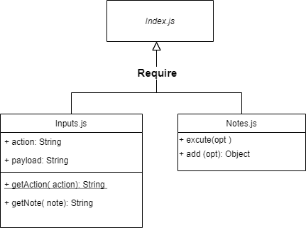

# Notes App

## Author: Fatima Atieh


### Overview

A terminal based (CLI) application allowing users to easily create and manage a list of categorized notes

Use the following on the terminal to run the app

`node index.js --add <note> --category <type>`

`node index.js -a <note> -c <type>`

`node index.js --list`

`node index.js --list <type>`

`node index.js --delete <id>`


## Modules

`inputs.js`

`notes.js`


## Setup


`npm i minimist`

`npm i jest`

`npm i mongoose`

`npm i @code-fellows/supergoose`


## Tests 

```
npm test
```


## UML - Class Diagram

